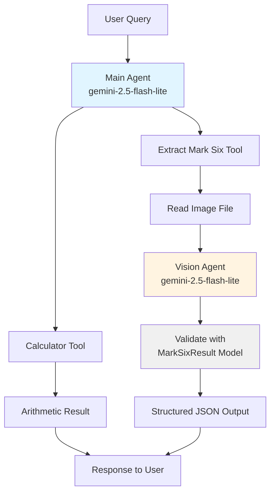

# Venturenix Next-Gen AI Development Class Cohort #5
## Lesson 09
## Installation

This project uses [uv](https://docs.astral.sh/uv/) for Python package management.

1. Install project dependencies:
```bash
uv sync
```

2. Set up environment variables by copying `env.sample` to `.env` and filling in your credentials:
```bash
cp env.sample .env
```

## Scripts

### main.py
A Pydantic AI agent demonstration featuring two specialized tools:
- **Calculator Tool**: Performs basic arithmetic operations (add, subtract, multiply, divide)
- **Mark Six Result Extractor**: Uses vision AI to analyze images of Hong Kong Mark 6 lottery results and extract structured data

The script demonstrates agent delegation by using a dedicated vision agent for image analysis. It includes two demo scenarios showcasing each tool.

**Agent Architecture:**


**Run it:**
```bash
uv run main.py
```

### echobot.py
A simple Telegram bot that echoes back any text message it receives. Supports `/start` and `/help` commands.

**Run it:**
```bash
uv run echobot.py
```

**Requirements:** Set `TELEGRAM_BOT_TOKEN` in your `.env` file.

### models.py
Contains Pydantic models for data validation:
- `MarkSixResult`: Validates Hong Kong Mark 6 lottery results with field validation for draw numbers, dates, main numbers (6 unique numbers between 1-49), and bonus number (must not be in main numbers).
