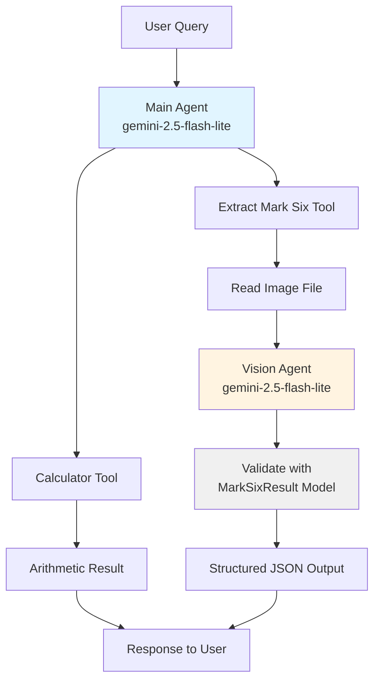
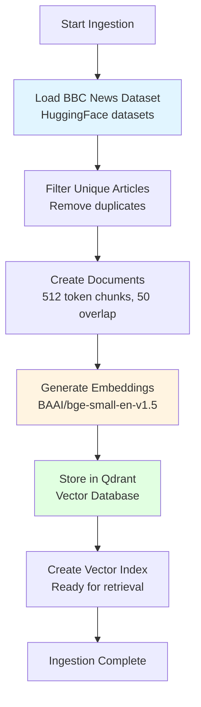
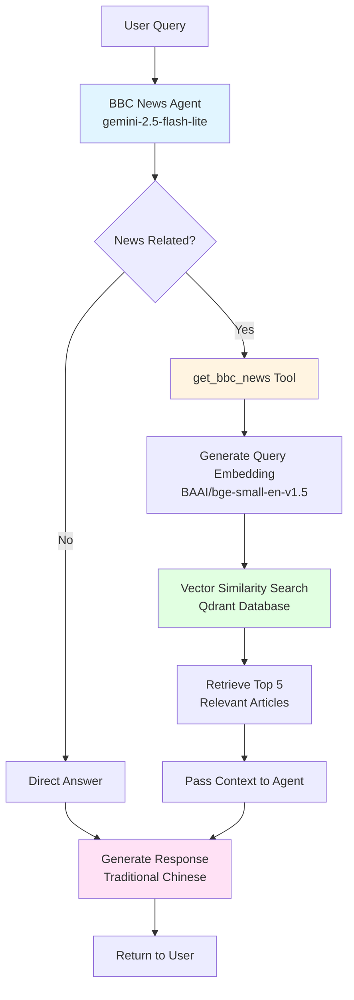

# Venturenix Next-Gen AI Development Class Cohort #5
## Lesson 10
## Installation

This project uses [uv](https://docs.astral.sh/uv/) for Python package management.

1. Install project dependencies:
```bash
uv sync
```

2. Set up environment variables by copying `env.sample` to `.env` and filling in your credentials:
```bash
cp env.sample .env
```

## Scripts

### main.py
A Pydantic AI agent demonstration featuring two specialized tools:
- **Calculator Tool**: Performs basic arithmetic operations (add, subtract, multiply, divide)
- **Mark Six Result Extractor**: Uses vision AI to analyze images of Hong Kong Mark 6 lottery results and extract structured data

The script demonstrates agent delegation by using a dedicated vision agent for image analysis. It includes two demo scenarios showcasing each tool.

**Agent Architecture:**


**Run it:**
```bash
uv run main.py
```

### echobot.py
A simple Telegram bot that echoes back any text message it receives. Supports `/start` and `/help` commands.

**Run it:**
```bash
uv run echobot.py
```

**Requirements:** Set `TELEGRAM_BOT_TOKEN` in your `.env` file.

### models.py
Contains Pydantic models for data validation:
- `MarkSixResult`: Validates Hong Kong Mark 6 lottery results with field validation for draw numbers, dates, main numbers (6 unique numbers between 1-49), and bonus number (must not be in main numbers).

## RAG (Retrieval-Augmented Generation) System

This project includes a complete RAG system that enables AI agents to answer questions based on a BBC news article database. The system supports both local (Qdrant) and cloud (Supabase) vector storage options.

### doc_ingestion.ipynb
Jupyter notebook for ingesting BBC news articles into a local Qdrant vector database.

**Features:**
- Loads BBC news dataset using HuggingFace `datasets` library
- Chunks articles into manageable pieces (512 tokens with 50 token overlap)
- Generates embeddings using `BAAI/bge-small-en-v1.5` model
- Stores vectors in local Qdrant database

**Document Ingestion Workflow:**


**Requirements:** Set `QDRANT_PATH` and `QDRANT_COLLECTION` in your `.env` file.

**Run it:**
```bash
jupyter notebook doc_ingestion.ipynb
```

### doc_ingestion_supabase.ipynb
Jupyter notebook for ingesting BBC news articles into a cloud-based Supabase vector database.

**Features:**
- Loads BBC news dataset using HuggingFace `datasets` library  
- Generates embeddings using `BAAI/bge-m3` model (1024 dimensions)
- Stores vectors in Supabase PostgreSQL with pgvector extension
- Supports rebuilding collection with `SUPABASE_REBUILD` flag

**Requirements:** Set `SUPABASE_POSTGRES_URI`, `SUPABASE_COLLECTION`, `SUPABASE_DIMENSION`, and `SUPABASE_REBUILD` in your `.env` file.

**Run it:**
```bash
jupyter notebook doc_ingestion_supabase.ipynb
```

### ragbot.py
RAG-based news agent using local Qdrant vector storage. The agent searches BBC news articles to answer questions about current events in Traditional Chinese.

**Features:**
- PydanticAI agent with custom retrieval tool
- Semantic search using LlamaIndex and Qdrant
- Returns top 5 most relevant article excerpts
- Integrated with Langfuse for observability

**RAG Agent Workflow:**


**Requirements:** 
- Run `doc_ingestion.ipynb` first to populate the vector database
- Set `QDRANT_PATH`, `QDRANT_COLLECTION`, and OpenRouter API credentials in your `.env` file

**Run it:**
```bash
uv run ragbot.py
```

### ragbot_supabase.py
RAG-based news agent using cloud Supabase vector storage. Functionally identical to `ragbot.py` but uses Supabase instead of local Qdrant.

**Features:**
- PydanticAI agent with custom retrieval tool
- Semantic search using LlamaIndex and Supabase
- Cloud-based vector storage with pgvector
- Integrated with Langfuse for observability

**Requirements:**
- Run `doc_ingestion_supabase.ipynb` first to populate the vector database
- Set `SUPABASE_POSTGRES_URI`, `SUPABASE_COLLECTION`, `SUPABASE_DIMENSION`, and OpenRouter API credentials in your `.env` file

**Run it:**
```bash
uv run ragbot_supabase.py
```
